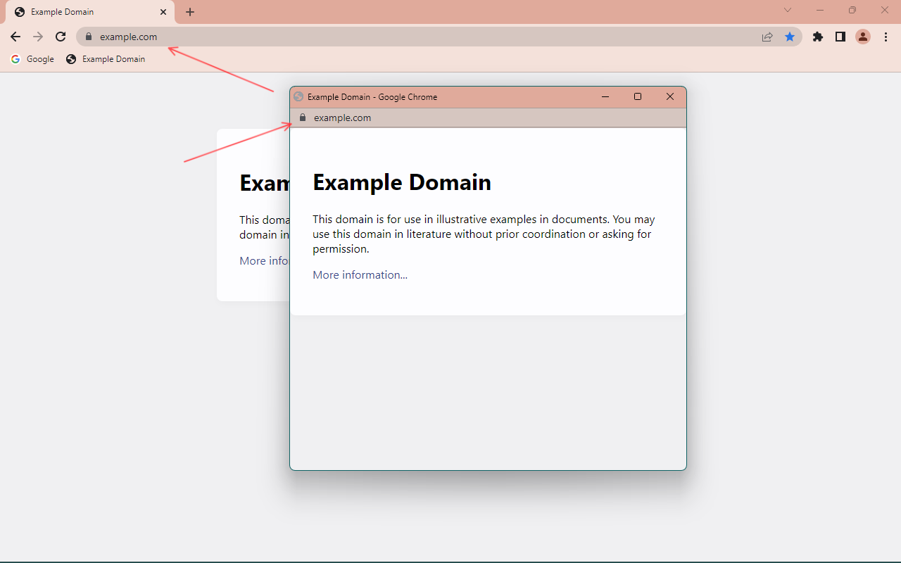

# Pop Off
A Chrome extension to make popups open as tabs instead of separate, feature-reduced windows.

## Description
Do popup windows annoy you?
Are they too small?
Do you want those windows to let you edit the URL or click your bookmarks?
Would you prefer a regular browser window?
Here is your solution!
Open all those popups as regular tabs.
Make them behave like any other tab, just like you always wanted!

## Install
- Download this repository.
- (Inspect the code to ensure it is not malicious.)
- Open [`chrome://extensions`](about:extensions).
- Click "Load unpacked" and select the directory containing this code.

## Privacy
Read the [privacy policy](https://github.com/linusbrogan/popoff/blob/main/privacy.md).
